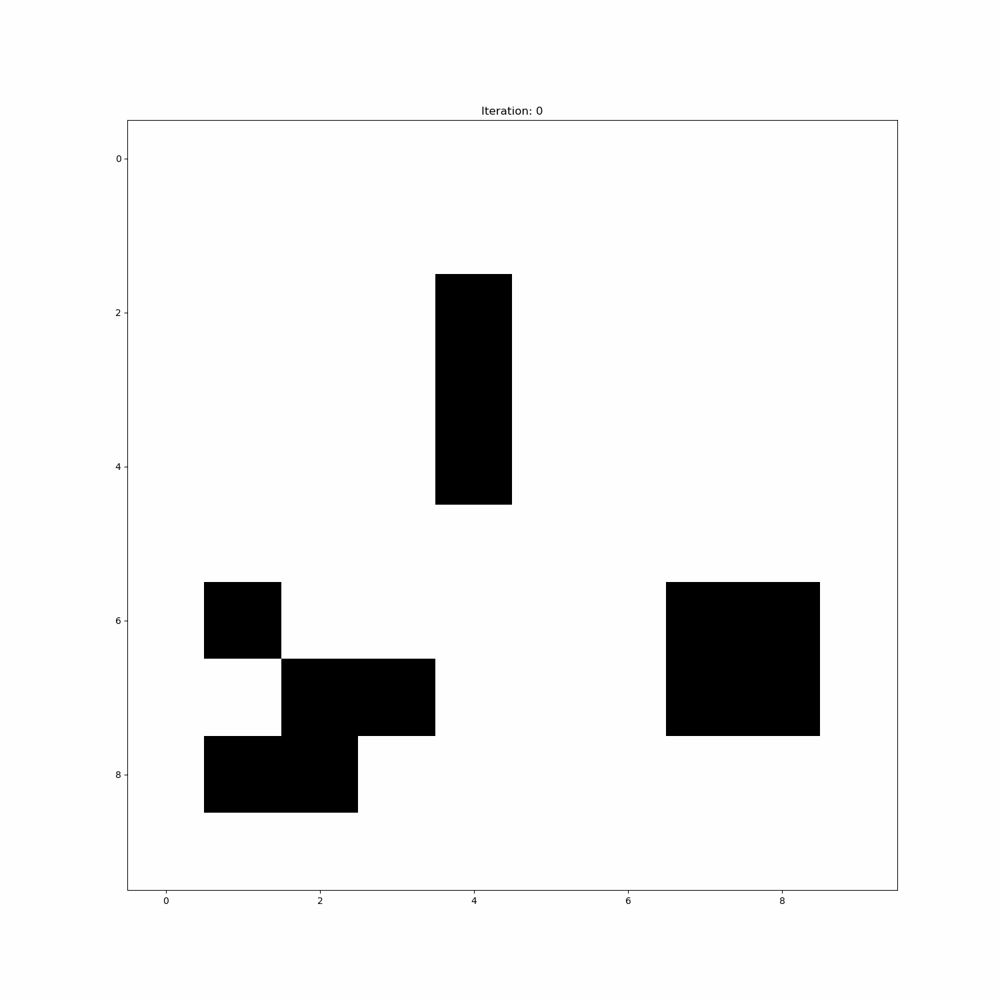
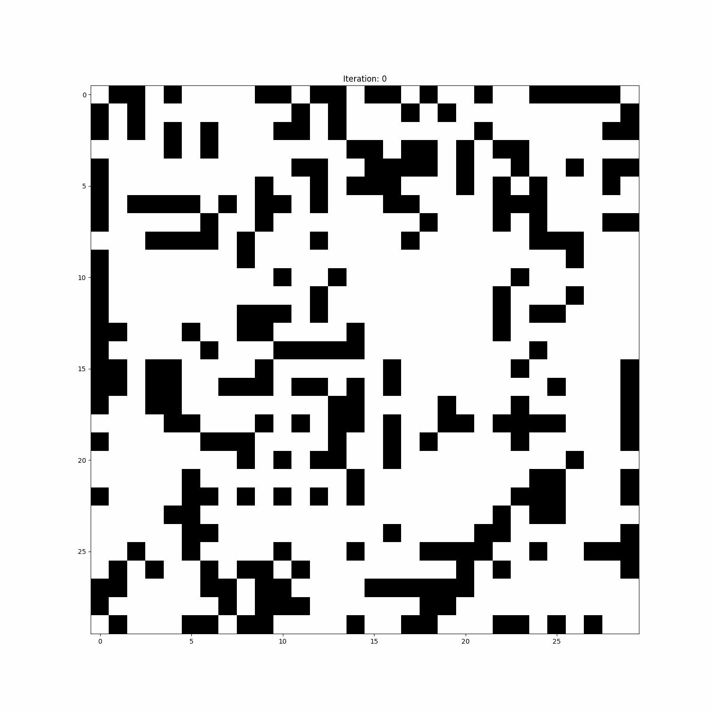

# game-of-life
Simmple implementation of game of life

For random generation of initial state:
```python
from gameoflife import GameOfLife
from pathlib import Path

game = GameOfLife(N=10, M=10, n_steps=10)

game.simulate()

game.save_as_gif(filename_path=Path("N_30_M_30_n_steps_10.gif"), fps=1,frames=10)
game.save_as_txt(filename_path=Path("N_30_M_30_n_steps_10.txt"))
# Should be the same as game.states (size 10,10,10)
states = game.load_from_txt(filename_path=Path("N_30_M_30_n_steps_10.txt"), n_steps=10)
```
Or specifying a initial state like:
```python
initial_state = np.array(
       [[0, 0, 0, 0, 0, 0, 0, 0, 0, 0],
        [0, 0, 0, 0, 0, 0, 0, 0, 0, 0],
        [0, 0, 0, 0, 0, 0, 0, 0, 0, 0],
        [0, 0, 0, 1, 1, 1, 0, 0, 0, 0],
        [0, 0, 0, 0, 0, 0, 0, 0, 0, 0],
        [0, 0, 0, 0, 0, 0, 0, 0, 0, 0],
        [0, 0, 1, 0, 0, 0, 0, 1, 1, 0],
        [1, 0, 1, 0, 0, 0, 0, 1, 1, 0],
        [0, 1, 1, 0, 0, 0, 0, 0, 0, 0],
        [0, 0, 0, 0, 0, 0, 0, 0, 0, 0]])

game = GameOfLife(N=10, M=10, n_steps=10, initial_state=initial_state)
```
## Examples
- Block blinker and glider


- Random generated initial state



